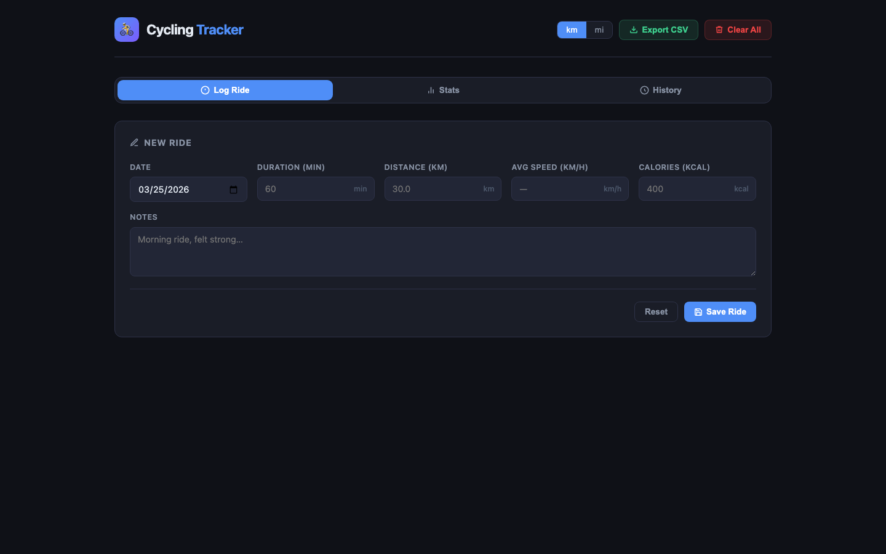

# 🚴 Cycling Tracker

A clean, zero-dependency cycling workout tracker web app. No frameworks, no build tools — just open `index.html` and ride.



## Features

- **Log workouts** — date, duration, distance, auto-calculated speed, calories, notes
- **Stats dashboard** — total rides, distance, time, average speed, best ride, calories burned
- **Bar chart** — visual history of last 10 rides by distance
- **Ride history** — full list with per-entry delete
- **Unit toggle** — km / miles, persisted across sessions
- **CSV export** — download all your data
- **Local storage** — everything lives in your browser, no server needed
- **Dark theme** — easy on the eyes
- **Responsive** — works on mobile and desktop

## Usage

Just open `index.html` in any modern browser. No installation, no dependencies.

```bash
open index.html
# or serve it locally:
python3 -m http.server 8080
```

## Tech

Vanilla HTML/CSS/JS. Zero dependencies. Single file.
